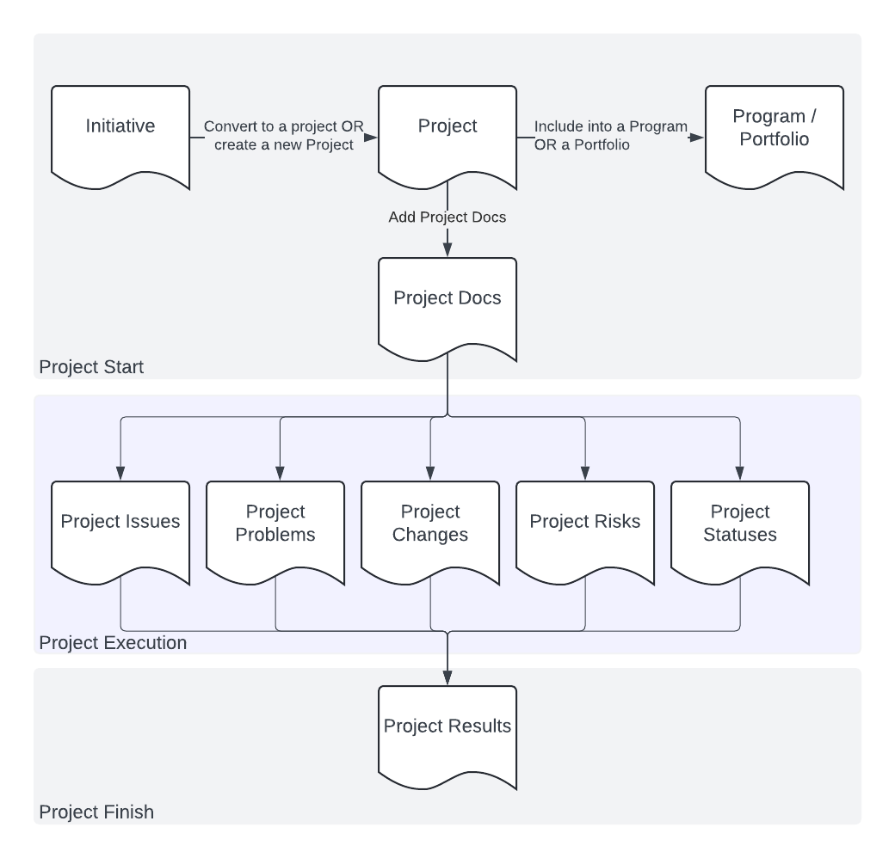

# Project Managment Thing

The goal is to manage the project lifecycle:

## Installation

1. Make sure you have Node.js installed.
2. Install dependencies: `npm i`.
3. Launch the app, for example: `DEBUG=pmo-express:* node --env-file=.env --watch ./bin/www`

A small demo-DB is included, if you start from an empty DB, you'll need migrations: `npx sequelize-cli db:migrate`.

You can register a user in the app.

## Background

Technically it's an experiment with Express and HTMX for me, you can read the background story [here](https://en.kovchinnikov.info/2024-11-express.html).
